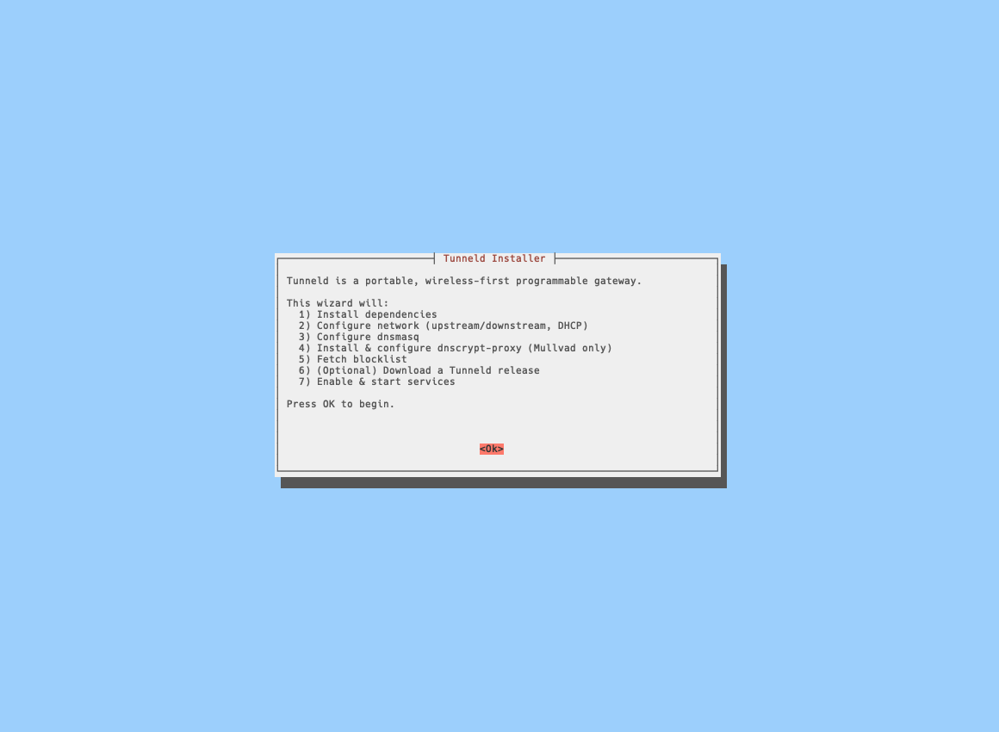
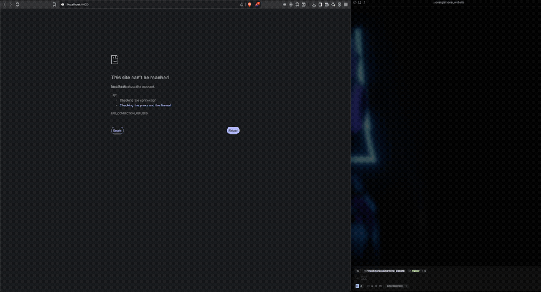

# Tunneld Installer

> **⚠️ Tunneld is in heavy active development (pre-alpha phase). Expect alot of breaking changes**
>
> A single ARM64 pre-alpha build is published at a time for testing.
> The source code and versioned releases will become available once the project is opened.
> For early access and feedback, contact @toreanjoel.

<div align="center">
   
</div>

---

Official installer script for **Tunneld** - a portable, wireless-first programmable gateway for self-hosters, developers, and edge network builders.

---

## What Tunneld Looks Like

Here is Tunneld in action — exposing a local service to the internet. <br />
Creating a public share on a self hosted control plane running on a Nano Pi Zero 2

<div align="center" style="margin-top: 20px;">
   
</div>

## Quick Remote Install

Install Tunneld directly:

```bash
curl -fsSL https://install.tunneld.sh | sudo bash
```

Uninstall:

```bash
curl -fsSL https://install.tunneld.sh | sudo bash
```

---

## Pre-Alpha Builds & Integrity

During the pre-alpha phase, the installer pulls:

- `releases/tunneld-pre-alpha.tar.gz`
- `releases/checksums.txt`

The installer:

1. Downloads the tarball  
2. Downloads `checksums.txt`  
3. Shows the expected SHA256  
4. Attempts verification  
5. Extracts into `/opt/tunneld`

Only **one** active pre-alpha build exists at any time - each new build replaces the previous one.

When Tunneld becomes public/open-source, this system will move to **signed, tagged semantic releases** (e.g. `v1.0.0`).

---

## What is Tunneld?

Tunneld is a portable, self-contained network gateway that provides:

### **Secure Service Sharing**
Expose local services through the OpenZiti overlay network using Zrok - without port forwarding, VPN clients, or exposing networks.

### **Wireless-First Zero-Trust Gateway**
A standalone gateway that:

- Acts as its own DHCP server  
- Provides an isolated local subnet  
- Enforces device-level policies  
- Requires no software installation on client devices  

### **Built-in Network Services**

- **DNS & DHCP** - via dnsmasq  
- **Encrypted DNS (DoH)** - via dnscrypt-proxy  
- **System-wide blocklists** - via Hagezi DNS blocklist  

All traffic stays local - no reliance on central infrastructure.

---

## What the Installer Does

The installer (`install.sh`) performs a guided setup:

### **1. Guided Configuration**
- Detects network interfaces  
- Prompts for:
  - Upstream (WAN/Wi-Fi)  
  - Downstream (LAN/AP)  
  - Gateway IP  
  - DHCP range  
  - Wi-Fi regulatory country  

### **2. Installs and Configures Dependencies**
Installs:

- dnsmasq  
- dhcpcd  
- dnscrypt-proxy (standalone binary)  
- nginx (default site disabled; add your own site files)
- iptables, bc, unzip, iw  
- systemd-timesyncd + fake-hwclock  
- OpenZiti + Zrok  

It also removes the packaged dnscrypt-proxy to avoid conflicts.

### **3. Configures System Services**
Creates:

- `/etc/tunneld/interfaces.conf`
- `/etc/tunneld/dnsmasq.conf`
- `/etc/tunneld/dhcpcd.conf`

Symlinks them into place:

- `/etc/dhcpcd.conf` → `/etc/tunneld/dhcpcd.conf`
- `/etc/dnsmasq.conf` → `/etc/tunneld/dnsmasq.conf`

Notes:

- The default nginx site is disabled to avoid port conflicts; add your own sites under `/etc/nginx/sites-available` and enable them as needed.

Fetches + installs the Hagezi blocklist.

### **4. Deploys Tunneld**
- Optionally downloads the pre-alpha release  
- Verifies the checksum  
- Extracts files to `/opt/tunneld`  
- Creates a `tunneld.service` systemd unit  
- Restarts all relevant services  

Services managed:

```
tunneld.service
nginx.service
dnscrypt-proxy.service
dnsmasq.service
dhcpcd.service
```

---

## After Installation

Access dashboard:

```
http://10.0.0.1
```

Verify services:

```bash
systemctl status nginx tunneld dnscrypt-proxy dnsmasq dhcpcd
```

Expose services using Zrok.

---

## Uninstallation

```bash
curl -fsSL https://raw.githubusercontent.com/toreanjoel/tunneld-installer/main/uninstall.sh -o uninstall.sh
chmod +x uninstall.sh
sudo ./uninstall.sh
```

The uninstaller will:

1. Stop and disable:
   - tunneld  
   - dnscrypt-proxy  
   - zrok-* services  

2. Remove:

```
/opt/tunneld
/etc/tunneld
/var/lib/tunneld
/var/log/tunneld
/var/run/tunneld
/usr/local/bin/dnscrypt-proxy
```

3. Remove nginx site link/config (`/etc/nginx/sites-{available,enabled}/tunneld-gateway`)  
4. Remove systemd units  
5. Remove `/etc/dhcpcd.conf` or `/etc/dnsmasq.conf` if they were symlinks to Tunneld  
6. Restart base services (best effort)

**Note:**  
The uninstaller never removes OS packages (dnsmasq, dhcpcd, nginx, iptables, etc.). Remove them manually with apt if desired. The nginx default site remains disabled; re-enable it if you need a generic site.

---

## Directory Layout

```
/opt/tunneld/              Application binaries and release files
/etc/tunneld/              Config files
/var/log/tunneld/          Logs
/var/lib/tunneld/          Persistent data
/var/run/tunneld/          Runtime files
```

---

## Key Configuration Files

| File                                  | Purpose                         |
| ------------------------------------- | ------------------------------- |
| `interfaces.conf`                     | Interface + subnet config       |
| `dhcpcd.conf`                         | Gateway routing                 |
| `dnsmasq.conf`                        | DNS & DHCP config               |
| `dnscrypt/dnscrypt-proxy.toml`        | Encrypted DNS settings          |
| `blacklists/dnsmasq-system.blacklist` | Ad/tracker block rules          |
| `/etc/nginx/sites-available/`         | Place your nginx site files; enable via `sites-enabled` |

---

## Support the Project

Tunneld builds on:

- OpenZiti / Zrok  
- Hagezi DNS Blocklists  
- dnscrypt-proxy  
- dnsmasq  
- dhcpcd
- nginx

These open-source tools make Tunneld possible.
